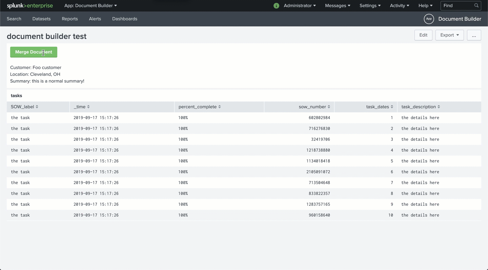

# document-builder

This is a Splunk app that helps you generate MS Word documents from Splunk data. The app leverages [docx-mailmerge](https://github.com/Bouke/docx-mailmerge) to "mail merge" a template with your Splunk data. See the included template and example dashboard to get started.

